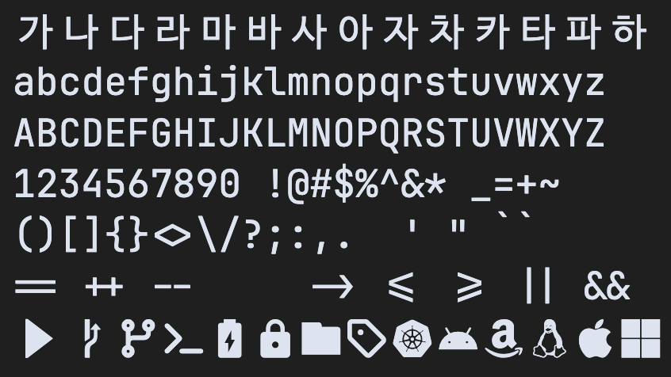
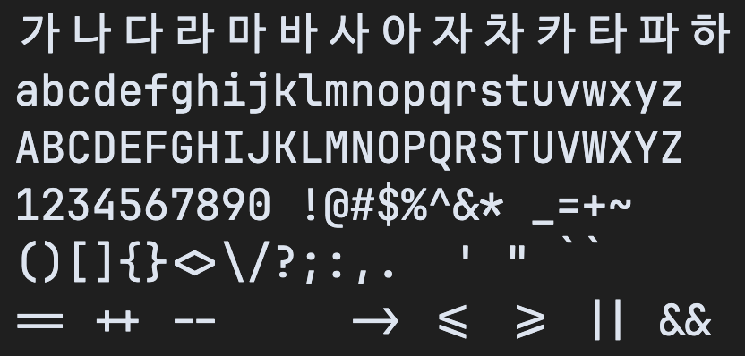
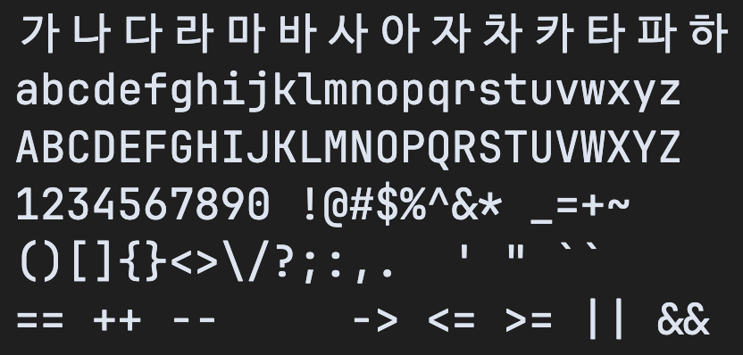

# Mabyko Mono

Mabyko Mono는 [JetBrains Mono](https://github.com/JetBrains/JetBrainsMono),
[D2Coding](https://github.com/naver/d2codingfont),
[Nerd Fonts](https://github.com/ryanoasis/nerd-fonts)를 합성한 한국어 친화
프로그래밍 폰트입니다.

한글과 라틴 문자를 함께 쓰는 코드 편집 환경에서 자연스럽게 보이는 고정폭 폰트를
목표로 합니다. 특히 VS Code에서 한글 wrap과 selection이 어긋나지 않도록,
한글과 full-width 문자의 폭을 라틴 문자 폭의 정확히 2배로 맞춥니다.

## 미리보기

| Mabyko Mono NF | Mabyko Mono | Mabyko Mono NL |
| :---: | :---: | :---: |
|  |  |  |

## 특징

- JetBrains Mono 기반의 라틴 문자와 프로그래밍 기호
- D2Coding 기반의 한글 glyph와 full-width metric
- Nerd Font symbols 포함 variant 제공
- 한글과 full-width glyph를 라틴 문자 2칸 폭으로 처리
- 기본 폭: half-width `600`, full-width `1200`

## 폰트 종류

| Variant | Family name | 설명 |
| --- | --- | --- |
| Standard NF | `Mabyko Mono NF` | Nerd Font symbols 포함 |
| Standard | `Mabyko Mono` | Nerd Font symbols 미포함 |
| Standard NL | `Mabyko Mono NL` | Nerd Font symbols 미포함, ligature 제거 |

각 variant는 `Thin`, `Light`, `Regular`, `Medium`, `SemiBold`, `Bold`를 제공합니다.
`NL`은 No Ligatures를 뜻합니다.

## 다운로드

최신 버전은 [Releases](https://github.com/mabyko/MabykoMono/releases/latest)에서
받을 수 있습니다.

## 설치

1. Releases에서 원하는 zip 파일을 다운로드합니다.
2. 압축을 풉니다.
3. 필요한 `.ttf` 파일을 설치합니다.

### macOS

`.ttf` 파일을 더블클릭한 뒤 Font Book에서 설치합니다.

### Windows

`.ttf` 파일을 선택한 뒤 우클릭해서 설치합니다.

### Linux

`.ttf` 파일을 `~/.local/share/fonts`에 복사한 뒤 font cache를 갱신합니다.

```sh
fc-cache -f
```

VS Code에서는 설치 후 아래처럼 설정합니다.

```json
{
  "editor.fontFamily": "Mabyko Mono NF"
}
```

## 빌드

필요한 도구:

- Python 3.12 이상
- [uv](https://github.com/astral-sh/uv)
- FontForge
- HarfBuzz `hb-shape`
- Fontconfig `fc-scan`

빌드와 검증:

```sh
uv sync
uv run python scripts/fetch.py
rm -rf build out/fonts
fontforge -script scripts/build_regular.py
uv run python scripts/fix_tables.py
uv run python scripts/check_metrics.py
uv run python scripts/test_font.py
uv run python scripts/test_outputs.py
```

산출물은 `out/fonts/` 아래에 생성됩니다.

## Contributing

- 새 glyph 범위나 metric 정책을 바꾸면 `scripts/test_font.py`에 검증을 추가합니다.
- 새 variant를 추가하면 `scripts/test_outputs.py`의 기대 산출물도 함께 갱신합니다.
- `sources/`, `build/`, `out/`은 생성물이라 커밋하지 않습니다.
- D2Coding의 Reserved Font Name 조건 때문에 family name에 `D2Coding`을 쓰지 않습니다.
- 릴리스 노트는 Release Drafter가 PR 라벨을 기준으로 한국어 draft를 만듭니다.
  PR에는 `feature`, `fix`, `font`, `build`, `docs`, `chore` 중 알맞은 라벨을 붙입니다.

## 라이선스

Mabyko Mono는 SIL Open Font License 1.1, 즉 OFL 1.1로 배포합니다.

이 프로젝트는 아래 폰트의 데이터를 사용합니다.

- JetBrains Mono: Copyright 2020 The JetBrains Mono Project Authors.
  https://github.com/JetBrains/JetBrainsMono
- D2Coding: Copyright NAVER Corp.
  https://github.com/naver/d2codingfont
- Nerd Fonts: Copyright (c) 2014 Ryan L McIntyre.
  https://github.com/ryanoasis/nerd-fonts

`JetBrains Mono`, `D2Coding`, `Nerd Fonts` 이름은 출처 표기를 위해서만 사용합니다.
생성되는 폰트 family name은 `Mabyko Mono`, `Mabyko Mono NF`, `Mabyko Mono NL`입니다.
