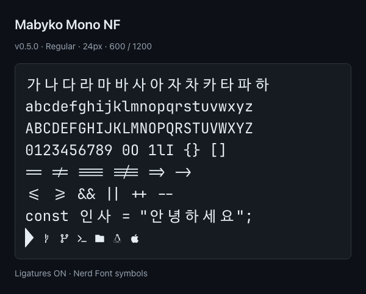
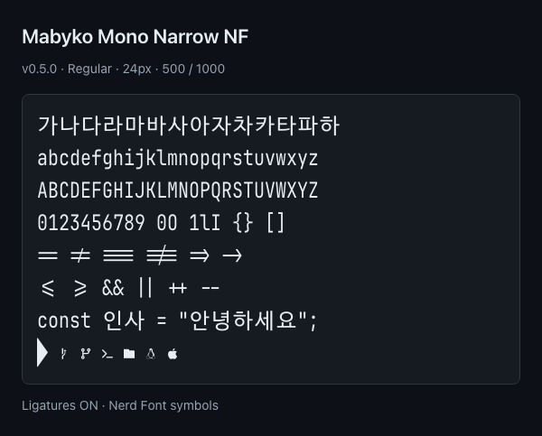
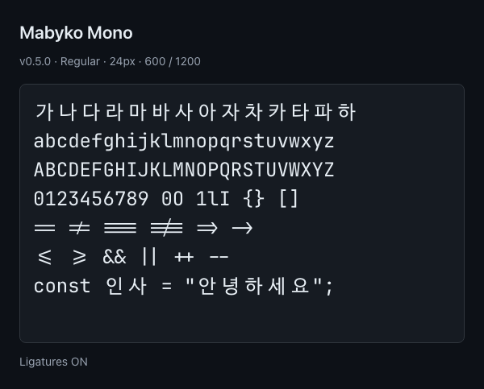
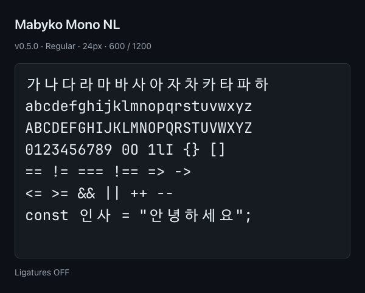
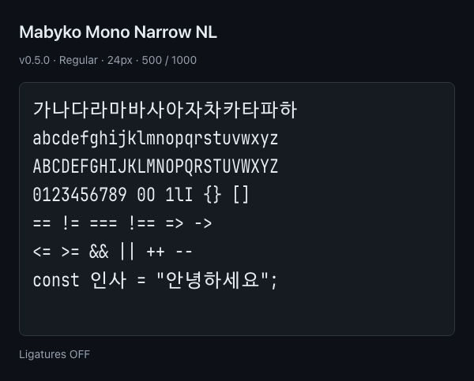
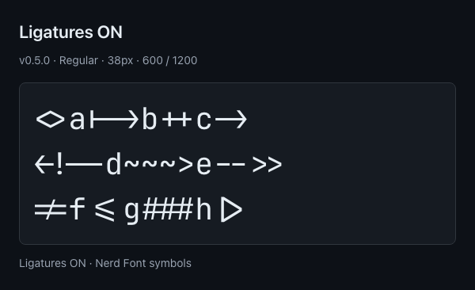
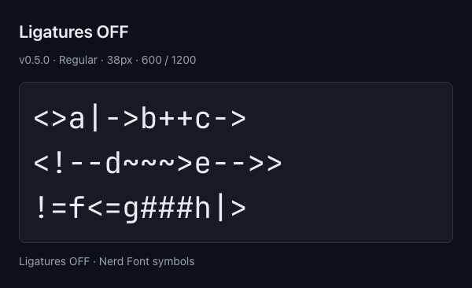

# Mabyko Mono

Mabyko Mono는 [JetBrains Mono](https://github.com/JetBrains/JetBrainsMono),
[D2Coding](https://github.com/naver/d2-coding-font),
[Nerd Fonts](https://github.com/ryanoasis/nerd-fonts)를 합성한 한국어 친화
프로그래밍 폰트입니다.

한글과 라틴 문자를 함께 쓰는 코드 편집 환경에서 자연스럽게 보이는 고정폭 폰트를
목표로 합니다. 특히 VS Code에서 한글 wrap과 selection이 어긋나지 않도록,
한글과 full-width 문자의 폭을 라틴 문자 폭의 정확히 2배로 맞춥니다.

## 미리보기

v0.5.0의 Regular를 모두 같은 글자 크기로 렌더한 샘플입니다.
Narrow는 글자 높이를 유지하면서 영문 폭과 한글 사이 여백을 줄입니다.
이미지를 누르면 원본 크기로 볼 수 있습니다.

| 기본형 · 600 / 1200 | Narrow · 500 / 1000 |
| :---: | :---: |
| [](assets/preview-MabykoMonoNF.png) | [](assets/preview-MabykoMonoNarrowNF.png) |
| [](assets/preview-MabykoMono.png) | [](assets/preview-MabykoMonoNarrow.png) |
| [](assets/preview-MabykoMonoNL.png) | [](assets/preview-MabykoMonoNarrowNL.png) |

합자를 켜거나 끈 모습도 비교할 수 있습니다. 아래 두 샘플은 같은 NF 폰트를 사용합니다.
NL 패밀리는 합자 자체를 포함하지 않습니다.

| 합자 ON | 합자 OFF |
| :---: | :---: |
| [](assets/ligature-on.png) | [](assets/ligature-off.png) |

브라우저 렌더링 샘플이므로 실제 에디터의 작은 글자 힌팅과 줄바꿈·선택 동작은 별도로 확인하세요.

## 특징

- JetBrains Mono 기반의 라틴 문자와 프로그래밍 기호
- D2Coding 기반의 한글 glyph와 full-width metric
- Nerd Font symbols 포함 variant 제공
- 한글과 full-width glyph를 라틴 문자 2칸 폭으로 처리
- 기본 폭: half-width `600`, full-width `1200`
- Narrow 폭: half-width `500`, full-width `1000`, 기존 글자 높이와 줄 높이 유지

## 폰트 종류

| Variant | Family name | 설명 |
| --- | --- | --- |
| Standard NF | `Mabyko Mono NF` | Nerd Font symbols 포함 |
| Standard | `Mabyko Mono` | Nerd Font symbols 미포함 |
| Standard NL | `Mabyko Mono NL` | Nerd Font symbols 미포함, ligature 제거 |
| Narrow NF | `Mabyko Mono Narrow NF` | `500/1000`, Nerd Font symbols 포함 |
| Narrow | `Mabyko Mono Narrow` | `500/1000`, Nerd Font symbols 미포함 |
| Narrow NL | `Mabyko Mono Narrow NL` | `500/1000`, Nerd Font symbols 미포함, ligature 제거 |

각 variant는 `Thin`, `Light`, `Regular`, `Medium`, `SemiBold`, `Bold`를 제공합니다.
`NL`은 No Ligatures를 뜻합니다.

기본형은 JetBrains Mono 영문과 D2Coding 한글의 기존 모양과 `600/1200` 폭을 유지합니다.
Narrow는 영문 윤곽의 가로만 `5/6`로 줄이고, 한글은 원본 윤곽을 그대로 `1000` 폭에 배치합니다.
두 계열 모두 한글은 영문 두 칸이며, 글자 높이와 줄 높이는 같습니다.
가로 밀도가 높은 코드가 편하다면 Narrow를, 원래 영문 비율이 편하다면 기본형을 선택하세요.

원본 버전: JetBrains Mono `2.304`, D2Coding `1.4.0`, Nerd Fonts `3.5.1`.
[버전 확인과 설계 결정](docs/font-variants.md)을 참고하세요.

## 다운로드

최신 버전은 [Releases](https://github.com/mabyko/MabykoMono/releases/latest)에서
받을 수 있습니다. [v0.5.0](https://github.com/mabyko/MabykoMono/releases/tag/v0.5.0)은 다음 6개 ZIP을 제공합니다.
필요한 종류의 ZIP 하나를 고르면 됩니다.

| 패밀리 | ZIP |
| --- | --- |
| Mabyko Mono | [MabykoMono-v0.5.0.zip](https://github.com/mabyko/MabykoMono/releases/download/v0.5.0/MabykoMono-v0.5.0.zip) |
| Mabyko Mono NL | [MabykoMono_NL_v0.5.0.zip](https://github.com/mabyko/MabykoMono/releases/download/v0.5.0/MabykoMono_NL_v0.5.0.zip) |
| Mabyko Mono NF | [MabykoMono_NF_v0.5.0.zip](https://github.com/mabyko/MabykoMono/releases/download/v0.5.0/MabykoMono_NF_v0.5.0.zip) |
| Mabyko Mono Narrow | [MabykoMono_Narrow_v0.5.0.zip](https://github.com/mabyko/MabykoMono/releases/download/v0.5.0/MabykoMono_Narrow_v0.5.0.zip) |
| Mabyko Mono Narrow NL | [MabykoMono_Narrow_NL_v0.5.0.zip](https://github.com/mabyko/MabykoMono/releases/download/v0.5.0/MabykoMono_Narrow_NL_v0.5.0.zip) |
| Mabyko Mono Narrow NF | [MabykoMono_Narrow_NF_v0.5.0.zip](https://github.com/mabyko/MabykoMono/releases/download/v0.5.0/MabykoMono_Narrow_NF_v0.5.0.zip) |

각 ZIP에는 6굵기의 TTF와 라이선스 고지가 들어 있습니다.
기본형과 Narrow는 별도 패밀리여서 함께 설치할 수 있습니다.

## 설치

1. Releases에서 원하는 zip 파일을 다운로드합니다.
2. 압축을 풉니다.
3. 필요한 `.ttf` 파일을 설치합니다.

### macOS

Homebrew로 설치하면 이후 업데이트도 brew로 관리할 수 있습니다.
먼저 캐스크 정보를 갱신한 뒤 필요한 설치 명령만 골라 실행하세요.

```sh
brew update

# 기본형
brew install --cask mabyko/tap/font-mabyko-mono-nf   # Nerd Font symbols 포함
brew install --cask mabyko/tap/font-mabyko-mono      # 일반
brew install --cask mabyko/tap/font-mabyko-mono-nl   # ligature 제거

# Narrow
brew install --cask mabyko/tap/font-mabyko-mono-narrow-nf
brew install --cask mabyko/tap/font-mabyko-mono-narrow
brew install --cask mabyko/tap/font-mabyko-mono-narrow-nl
```

v0.5.0의 기본형·Narrow 6종 모두 tap에서 설치할 수 있습니다.

Homebrew 없이 설치할 때는 `.ttf` 파일을 더블클릭한 뒤 Font Book에서 설치합니다.
직접 설치한 같은 패밀리의 구버전은 교체하거나 제거한 뒤 설치하세요.
brew로 이미 관리 중인 폰트는 서체관리자에서 지우지 않고 아래 업데이트 명령을 사용합니다.

### Windows

`.ttf` 파일을 선택한 뒤 우클릭해서 설치합니다.

### Linux

`.ttf` 파일을 `~/.local/share/fonts`에 복사한 뒤 font cache를 갱신합니다.

```sh
fc-cache -f
```

### VS Code 설정

설치 후 VS Code를 다시 실행하고 아래처럼 설정합니다.

```json
{
  "editor.fontFamily": "'Mabyko Mono NF', monospace",
  "editor.fontLigatures": true,
  "terminal.integrated.fontFamily": "'Mabyko Mono NF'"
}
```

Narrow NF를 쓰려면 `editor.fontFamily`를 `"'Mabyko Mono Narrow NF', monospace"`로 바꿉니다.
내장 터미널도 바꾸려면 `terminal.integrated.fontFamily`를 `"'Mabyko Mono Narrow NF'"`로 지정합니다.
다른 종류도 위 표의 패밀리 이름을 그대로 사용합니다.
합자를 끄려면 `editor.fontLigatures`를 `false`로 설정하거나 NL 패밀리를 선택하세요.
[VS Code 폰트·터미널 설정](https://code.visualstudio.com/docs/terminal/appearance#_text-style)을 참고하세요.

### 업데이트

#### Homebrew로 설치한 경우

`brew update`는 캐스크 정보를 갱신하고, `brew upgrade`는 설치된 폰트를 새 버전으로 교체합니다.
기존 폰트를 직접 삭제할 필요는 없습니다. 아래는 NF 기본형을 업데이트하는 예입니다.

```sh
brew update
brew upgrade --cask mabyko/tap/font-mabyko-mono-nf
```

Narrow NF는 명령의 캐스크 이름을 `mabyko/tap/font-mabyko-mono-narrow-nf`로 바꿉니다.
다른 패밀리도 설치할 때 사용한 캐스크 이름을 지정하세요.

brew의 설치 기록과 버전은 다음 명령으로 확인합니다.

```sh
brew list --cask --versions font-mabyko-mono-nf
# 예: font-mabyko-mono-nf 0.5.0
```

이 기록은 파일 존재 여부를 검사하는 명령은 아닙니다.
서체관리자에서 brew가 설치한 파일만 지우면 설치 기록이 남아 업그레이드가 실패할 수 있습니다.

#### 파일을 지웠거나 설치가 깨진 경우

`It seems the Font source '…/Library/Fonts/MabykoMonoNF-Bold.ttf' is not there`와 같은
오류는 brew의 설치 기록과 실제 파일이 어긋났을 때 발생할 수 있습니다.
해당 캐스크만 강제 재설치해서 설치 기록과 폰트 파일을 다시 맞춥니다.

```sh
brew update
brew reinstall --cask --force mabyko/tap/font-mabyko-mono-nf
```

`--force`는 남아 있는 동일 경로의 파일을 덮어쓸 수도 있으므로,
일반 업데이트에는 위의 `upgrade`를 사용하고 복구할 때만 사용하세요.
재설치 후 `brew list --cask --versions`로 버전을 확인하고 에디터·터미널을 다시 실행합니다.

#### 직접 설치한 경우

- macOS: 직접 설치한 같은 패밀리의 구버전만 Font Book에서 교체하거나 제거합니다.
  brew로 전환하려면 먼저 위 명령으로 brew 관리 여부를 확인하세요. 이미 관리 중이면 `upgrade`를 사용합니다.
- Windows: 설정 → 개인 설정 → 글꼴에서 제거한 뒤 새로 설치합니다.
- Linux: `~/.local/share/fonts`의 기존 파일을 덮어쓰고 `fc-cache -f`를 실행합니다.

설치·업데이트 후에는 폰트를 쓰는 앱을 다시 실행하세요. macOS에서 같은 패밀리가 중복되면
Font Book의 **파일 → 중복 해결**에서 복사본의 버전과 위치를 확인합니다.

[Homebrew 명령 설명](https://docs.brew.sh/Manpage)과
[Font Book 설치·중복 해결 안내](https://support.apple.com/guide/font-book/fntbk1000/mac)를 참고하세요.

## 빌드

### 로컬 빌드

필요한 도구:

- Python 3.12 이상
- [uv](https://github.com/astral-sh/uv)
- FontForge
- HarfBuzz `hb-shape`
- Fontconfig `fc-scan`

빌드와 검증:

```sh
uv sync --locked
uv run --locked python scripts/fetch.py
rm -rf build out/fonts
fontforge -script scripts/build_regular.py
uv run --locked python scripts/fix_tables.py
uv run --locked python scripts/test_font.py
uv run --locked python scripts/package_release.py
uv run --locked python scripts/test_outputs.py
```

산출물은 `out/fonts/` 아래에 생성됩니다.
Release zip 파일은 `out/release/` 아래에 생성됩니다.
각 ZIP에는 폰트 6개와 `LICENSE`, 원본 저작권·라이선스 고지를 담은 `licenses/`가 포함됩니다.
총 36개 TTF와 6개 ZIP을 생성합니다. Narrow ZIP은 `MabykoMono_Narrow_v*.zip`,
`MabykoMono_Narrow_NF_v*.zip`, `MabykoMono_Narrow_NL_v*.zip`입니다.
`testdata/preview.html`에서 기본형·Narrow·NL·NF와 두 칸 정렬을 확인할 수 있습니다.

### Docker 빌드

로컬에 FontForge나 HarfBuzz를 설치하지 않고 Docker로도 같은 빌드를 실행할 수 있습니다.

```sh
docker compose run --rm build
```

Docker는 현재 작업 폴더만 `/work`로 마운트합니다. Python 가상환경과 uv cache는
Docker 전용 volume을 사용하므로 로컬 `.venv`는 사용하지 않습니다. Docker 환경을
초기화하려면 `docker compose down -v`를 실행합니다.

Docker 이미지는 `mabyko/mabyko-mono-build:1.2.0` 이름으로
생성됩니다.
이미지까지 지우려면 아래 명령을 실행합니다.

```sh
docker compose down -v
docker image rm mabyko/mabyko-mono-build:1.2.0
```

이미 생성된 산출물을 다시 검증할 때:

```sh
docker compose run --rm test
```

컨테이너 shell로 들어갈 때:

```sh
docker compose run --rm shell
```

### 재현성과 CI

Docker 빌드는 Ubuntu 이미지 digest, APT 스냅샷(`20260905T000000Z`),
uv `0.12.23`을 고정합니다. Python은 스냅샷의 시스템 Python을 사용하고,
fontTools는 `uv.lock`에 고정된 버전을 `--locked`로 설치합니다.
로컬 빌드는 설치된 FontForge·HarfBuzz 버전에 따라 결과가 달라질 수 있습니다.

`config.ini`의 `source_date_epoch`는 TTF와 ZIP의 고정 생성 시각(UTC Unix 초)입니다.
폰트의 생성·수정 시각을 통일하고 FontForge의 `FFTM` 시각 테이블은 제거합니다.
ZIP은 파일의 수정 시각이나 권한에 영향을 받지 않도록 패키징합니다.
PR과 `main` push의 CI는 전체 빌드·검증 후 다시 빌드해 TTF 36개와 ZIP 6개의 SHA256을 비교합니다.
해시 일치는 같은 아키텍처와 고정된 빌드 환경을 기준으로 검증합니다.

도구 버전을 갱신할 때는 Dockerfile의 이미지 digest와 APT 스냅샷을 갱신하고
전체 빌드·해시 비교를 다시 수행합니다. 원본 폰트를 갱신할 때는 `config.ini`의
버전·URL·SHA256·경로와 `licenses/`의 해당 원본 고지를 함께 갱신합니다.
프로젝트 버전은 `config.ini`와 `pyproject.toml`을 함께 바꾸고 `uv lock`으로 반영합니다.

다운로드나 FontForge 없이 빌드 스크립트의 회귀 검증만 실행할 수도 있습니다.

```sh
uv run --locked python scripts/test_build.py
```

ZIP·tar 압축 해제는 임시 폴더에서 완료된 뒤 원본 폴더로 이동합니다.
실패하면 임시 파일을 정리하므로 재실행할 수 있습니다.
Docker 빌드·검증은 `scripts/test_tap.py`로 릴리스 자동화의 캐스크 생성·URL·SHA256·재실행도 검사합니다.
이 검사는 Linux의 `bash`·`sed`·`sha256sum`을 사용하며 네트워크나 실제 tap 쓰기 없이 실행합니다.

## Contributing

- 새 glyph 범위나 metric 정책을 바꾸면 `scripts/test_font.py`에 검증을 추가합니다.
- 새 variant를 추가하면 `scripts/test_outputs.py`의 기대 산출물도 함께 갱신합니다.
- `sources/`, `build/`, `out/`은 생성물이라 커밋하지 않습니다.
- D2Coding의 Reserved Font Name 조건 때문에 family name에 `D2Coding`을 쓰지 않습니다.
- 릴리스 노트는 Release Drafter가 PR 라벨을 기준으로 한국어 draft를 만듭니다.
  PR에는 `feature`, `fix`, `font`, `build`, `docs`, `chore` 중 알맞은 라벨을 붙입니다.

## 라이선스

Mabyko Mono는 SIL Open Font License 1.1, 즉 OFL 1.1로 배포합니다.

이 프로젝트는 아래 폰트의 데이터를 사용합니다.

- JetBrains Mono: Copyright 2020 The JetBrains Mono Project Authors.
  https://github.com/JetBrains/JetBrainsMono
- D2Coding: Copyright NAVER Corp.
  https://github.com/naver/d2-coding-font
- Nerd Fonts: Copyright (c) 2014 Ryan L McIntyre.
  https://github.com/ryanoasis/nerd-fonts

원본 배포본의 고지는 `licenses/`에 보존합니다. JetBrains Mono와 D2Coding의
OFL 전문 및 Nerd Fonts 배포본의 MIT 라이선스를 릴리스 ZIP에도 동봉합니다.

`JetBrains Mono`, `D2Coding`, `Nerd Fonts` 이름은 출처 표기를 위해서만 사용합니다.
생성되는 폰트 family name은 위의 폰트 종류 표에 있는 기본형·Narrow 6종입니다.
